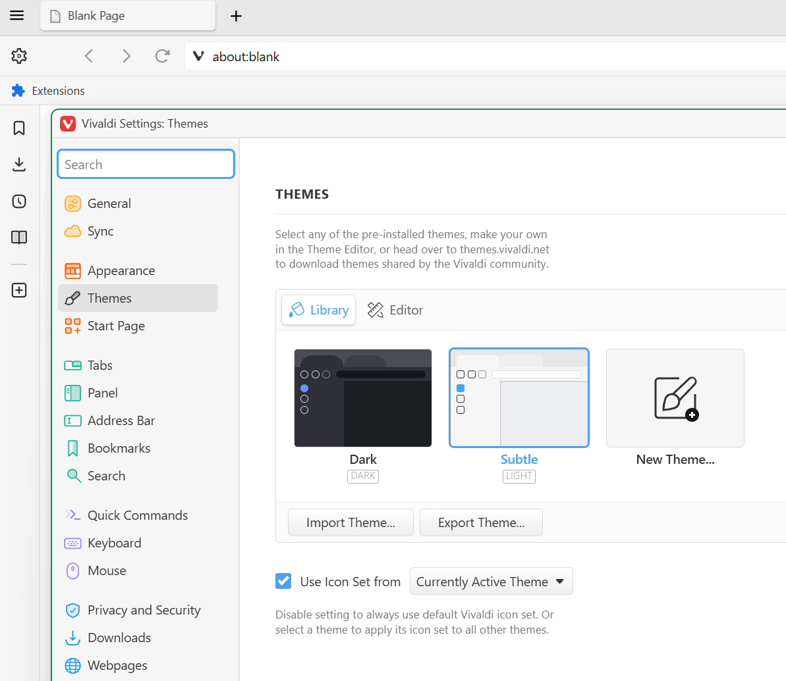
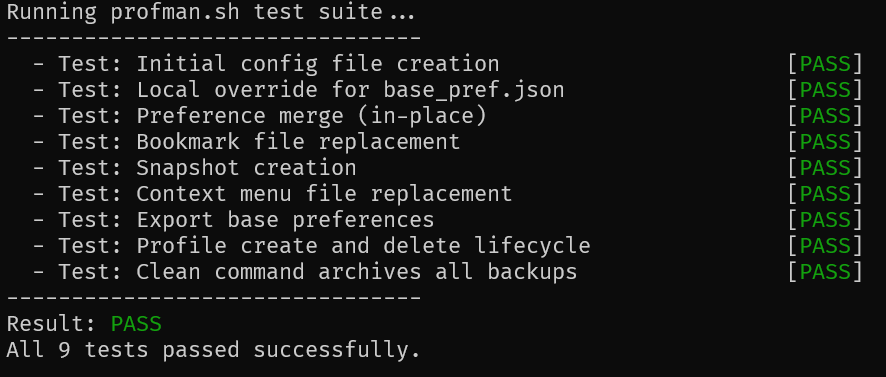
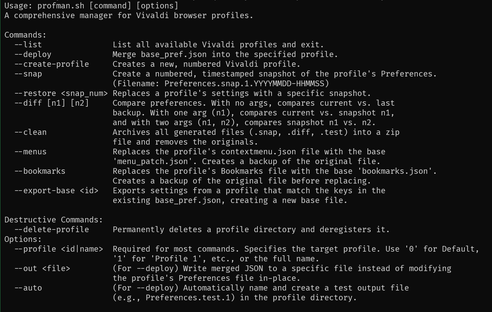

# Profile Manager for Vivaldi (`profman.sh`) v0.8.2

`profman.sh` is a powerful BASH command-line tool for managing Vivaldi browser profiles. It allows you to define a base set of preferences and apply them across multiple profiles, create and restore snapshots, manage bookmarks and context menus, and perform advanced operations like diffing configurations and creating/deleting profiles programmatically. This README file explains the features, patterns and limitations of the tool.


## ✨ Features

- **Profile Management**: List, create, and permanently delete Vivaldi profiles.
- **Preference Merging**: Define a `base_pref.json` file and merge its settings into any profile, preserving other settings.
- **Snapshot System**: Create timestamped snapshots of a profile's preferences, compare them, and restore to any previous state.
- **Configuration Templating**: Replace a profile's baseline bookmarks or context menus with a master version from your configuration directory.
- **Settings Export**: Export the configuration from an existing profile to create a new base template.
- **Housekeeping**: Clean up all generated backup and diff files into a single zip archive.
- **Convenience**: Use `--deploy-all` to apply all Profile configurations at once to a single profile (Perf + Bookmarks + Context Menu).
- **Cross-Platform**: Works on Linux, macOS, and in WSL for Windows and possibly other POSIX-compliant environments with a Bash shell.


<br>

## 🧼 Default Experience

The default skeleton preferences for Profman create a clean debloated UX that you can deploy to all your profiles out-of-the-box: 




<br>

## 🔧 Prerequisites

Before using `profman.sh`, you need to have the following command-line utilities installed:

- `jq`: For processing JSON data.
- `zip`: For the `--clean` command.
- `diffutils`: For the `--diff` command.

On Debian/Ubuntu, you can install them all with:
```bash
sudo apt-get update
sudo apt-get install jq zip diffutils
```


<br>

## ⚠️ Important Notes!

🔄 *Version 0.8.x introduces a breaking change. Please review the [CHANGELOG.md](CHANGELOG.md) for details if you started with 0.7.x version.*


<br>

- **Beta Software**. This script is in active development. Features may change, and Vivaldi updates could introduce breaking changes. Use at your own risk. 

- **Issues**. The Bookmark and Context Menu features have inconsistent issues which means they may not write correctly all the time. I suspect this is because Vivaldi is using sqlite to cache some settings. You may experience some inconsistencies on these features.

- **Contributions**. If you're a BASH enthusiast, your ideas are welcome! Please update test.sh with relevant test cases when submitting a pull request. 

- **Always Backup**. Profman is powerful but opinionated. Before you start, manually back up your Preferences, Bookmarks, and contextmenu.json files for any existing profiles. 

- **Minimal Settings**. The default skeleton files are designed to be minimal. They will remove all existing themes (except a system dark/light), bookmarks, and context menus. Export/Copy your settings first if you want to keep them! 

- **Security & Syncing**. Profman does not manage Vivaldi Sync. Disable syncing before making changes to avoid corruption. Never use Profman to modify encrypted settings, as it can corrupt your profile permanently. ALSO!

- **Extensions**. Extensions are cryptographically tied to each profile's unique ID in order to create a security context. Due to this limitation-by-design you CANNOT use Profman to manage your extensions or otherwise manually copy them without breaking this security context (leads to a corrupted profile).  On that note, Profman defaults add an Extensions shortcut to the bookmark bar for convenience. 

- **Bookmarks**. Bookmarks use a checksum to verify the contents and timestamp, so you can have a root Bookmark file to use for bookmarks.json so long as youve originally configured it in an active Vivaldi Profile to generate a correct checksum. (Had a few issues with bookmark inconsistencies but it was due to my overriding the checksum value to 0. So now the included `skel/bookmarks.skel.json` is a fully qualifiied base file.) By default Profman will load Extensions and Profile Manager links under a `_tools` folder on your bar for easy access.

- **Test For Portability**. Use `test.sh` to validate Profman's core behaviors (12 in version 0.8.2) on your OS. Not all features are tested across all systems. Compatibility testing is your responsibility. 


<br>

## 📃 Configuration Files and Skeletons

`profman` is driven by three user-configurable files located in the project's root directory:

-   `base_pref.json`: Your master set of preferences to merge.
-   `bookmarks.json`: Your master set of bookmarks to deploy.
-   `menu_patch.json`: Your master context menu configuration.

### First-Run Initialization

When you run `profman` for the first time, it checks if these files exist. If they don't, it automatically creates them for you using a set of default "skeleton" templates from the `skel/` directory. **Once created, these files will not be overwritten.** This allows you to safely edit and customize them.

The general data flow is:

```
[ Skeletons ]  -> (creates on first run) ->  [ Your Config Files ]  -> (deploys to) -> [ Vivaldi Profile ]
```

### Overriding the Defaults

You can control which templates are used during this initial creation:

-   **Preferences (`base_pref.json`)**: To use your own custom starting template for preferences, create a file named `local.base_pref.json` in the project root. If this file exists, it will be copied to `base_pref.json` instead of the default skeleton. This is the recommended way to maintain a personal base configuration.
-   **Bookmarks & Menus**: To use your own master files for bookmarks and menus from the start, simply create your own `bookmarks.json` and `menu_patch.json` in the project root *before* running the script for the first time.

This approach allows you to maintain your own set of master files without ever needing to modify the `skel/` directory, making updates to the script cleaner.

<br>

## ⚙️ Setup and Configuration

1.  **Make Scripts Executable**:
    ```bash
    chmod +x profman.sh test.sh
    ```

2.  **Configure Vivaldi Path**: The script needs to find your Vivaldi "User Data" directory.
    -   **WSL**: The script auto-detects WSL. Just set the `WIN_USER_ROOT` environment variable in your `.bashrc` or `.zshrc`:
        ```bash
        export WIN_USER_ROOT="/mnt/c/Users/YourWindowsUsername"
        ```
    -   **Linux/macOS**: Edit `profman.sh` and set the `VIVALDI_USER_DATA_PATH_MANUAL` variable to the correct absolute path.

3.  **Local Preference Overrides**: If you want to use a `local.base_pref.json` as the source for your generated `base_pref.json` add this to the project base before running any commands. Note that Profman will not backup or version your local configurations so be sure to back them up manually.

4. **Generate Config Files**: Run the script for the first time to create your master configuration files (`base_pref.json`, `bookmarks.json`, `menu_patch.json`).
    ```bash
    ./profman.sh --list
    ```
    The script will not overwrite these files once they exist, so you can customize them freely. If you need to reset these files at any time you can simply delete them and run the script again.

<br>


## 💻 Command Reference




### Profile Selection

**IMPORTANT: Always ensure Vivaldi is completely closed before running any commands that modify profile data. Do not configure or enable profile syncing until AFTER you're done making the changes you want.**

All commands that operate on a profile require the `--profile` argument.

`--profile <id|name>`
: Specifies the target profile.
  - Use `0` for the `Default` profile.
  - Use a number (e.g., `1`) for `Profile 1`.
  - Use the full quoted name (e.g., `"Profile 1"`).

---

### Core Commands

`--deploy`
: Merges the settings from `base_pref.json` into the specified profile's `Preferences` file.
  ```bash
  # Merge base settings into the Default profile
  ./profman.sh --profile 0 --deploy
  ```
<br>
  
`--deploy-all`
: A convenience command that runs --deploy, --bookmarks, and --menus in sequence for the specified profile. It streamlines applying a full set of configurations with a single confirmation.
  ```bash
  # Merge base settings into the Default profile
  ./profman.sh 
  ```
<br>
  
`--list`
: Lists all available Vivaldi profiles with their corresponding IDs.
  ```bash
  ./profman.sh --list
  ```
<br>
  
`--snap`
: Creates a numbered, timestamped snapshot of the target profile's `Preferences` file.
  ```bash
  # Create a snapshot for Profile 1
  ./profman.sh --profile 1 --snap
  ```
<br>
  
`--restore <snap_num|original>`
: Replaces a profile's current `Preferences` with a specific snapshot. A backup of the current settings is created first.
  ```bash
  # Restore Profile 1 to its state from snapshot #2
  ./profman.sh --profile 1 --restore 2

  # Restore Profile 2 to its original state before any deployments
  ./profman.sh --profile 2 --restore original
  ```
<br>
  
`--diff [n1] [n2]`
: Compares preference files and shows the differences.
  - **No args**: Compares the current `Preferences` with the backup from the last merge.
  - **One arg (n1)**: Compares the current `Preferences` with snapshot `n1`.
  - **Two args (n1, n2)**: Compares snapshot `n1` with snapshot `n2`.
  ```bash
  # See what changed in Default profile since the last merge
  ./profman.sh --profile 0 --diff

  # Compare current settings of Profile 1 with its 3rd snapshot
  ./profman.sh --profile 1 --diff 3
  ```
<br>
  
`--clean`
: Finds all generated files (`.snap.*`, `.test.*`, `.diff`, backups) for a profile, archives them into a `.zip` file, and removes the originals.
  ```bash
  ./profman.sh --profile 1 --clean
  ```
<br>
  
---

### File Replacement Commands

> **⚠️ Note on Merge vs. Copy**
> Unlike the `--deploy` command which intelligently *merges* settings, the `--menus` and `--bookmarks` commands perform a brute-force copy, completely overwriting the target file.
> - The default `bookmarks.json` skeleton is pristine and nearly empty.
> - The default `menu_patch.json` skeleton adds "Inspect Element" and "View Source" to context menus while removing the "Create QR Code" option.
> - To use your own custom files, manually copy them into the project root and rename them. An export feature is not yet implemented.

  
<br>

`--menus`
: Replaces the profile's `contextmenu.json` file with your master `menu_patch.json`. A backup of the original file is created.
  ```bash
  ./profman.sh --profile 2 --menus
  ```
<br>
  
`--bookmarks`
: Replaces the profile's `Bookmarks` file with your master `bookmarks.json`. A backup of the original file is created.
  ```bash
  ./profman.sh --profile 2 --bookmarks
  ```

<br>

---

### Advanced & Destructive Commands

`--create-profile`
: Programmatically creates a new, numbered Vivaldi profile by updating the `Local State` file. Note that this function only adds the scaffolding, you'll have to manually open the profile in Vivaldi in order for it to generate its first-run files before adding prefernces to it.
  ```bash
  ./profman.sh --create-profile
  ```

<br>

`--delete-profile`
: **IRREVERSIBLE**. Permanently deletes a profile directory and deregisters it from the `Local State` file. You will be asked for confirmation.
  ```bash
  ./profman.sh --profile 4 --delete-profile
  ```

<br>

`--export-base <id>`
: Creates a new `base_pref.exported.json` file. This file will contain the settings from the specified profile, but only for the keys that already exist in your `base_pref.json` template. This is useful for updating your base configuration from a profile you've configured in the UI.
  ```bash
  ./profman.sh --export-base 0
  ```

<br>

---

### Deploy Options

These options modify the behavior of the `--deploy` command.

`--out <file>`
: Writes the result of a merge to a specified file instead of modifying the profile's `Preferences` file in-place.

`--auto`
: A "dry run" mode. Automatically names and creates a test output file (e.g., `Preferences.test.1`) in the profile directory without modifying the original.
  ```bash
  # Do a dry run merge on Profile 2
  ./profman.sh --profile 2 --deploy --auto
  ```

<br>

## 🏃‍♂️Example Workflow

This workflow assumes you have already:
- Downloaded and installed Vivaldi.
- Launched Vivaldi at least once to create and initialize the `Default` profile.
- Closed Vivaldi completely before running any `profman.sh` commands.

1.  **Initialize**: Run `./profman.sh --list` to generate your config master files.

2.  **Configure**: Open `base_pref.json`, `bookmarks.json`, and `menu_patch.json` and customize them to your liking.

3.  **Apply**: Run `./profman.sh --profile 0 --deploy-all` to apply all master configurations to the Default profile.

4.  **Snapshot**: Create a baseline snapshot: `./profman.sh --profile 0 --snap`.

5.  **Use Vivaldi**: Launch Vivaldi, use the browser, and change some settings via the UI.

6.  **Review Changes**: Close Vivaldi and run `./profman.sh --profile 0 --diff` to see exactly what settings were changed by your UI interactions.

7.  **Update Base Config**: If you like the changes, use `./profman.sh --export-base 0` and review the exported file to update your `base_pref.json`.


<br>

## ✅ Testing

The project includes a test suite to verify its core functionality. It runs in a temporary, isolated environment and will not affect your real Vivaldi data.

To run the tests:
```bash
./test.sh
```

## License

MIT.
