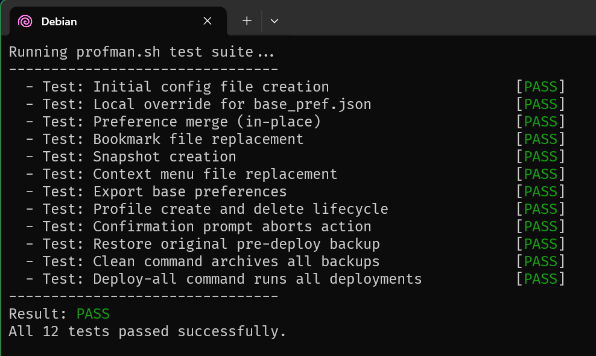
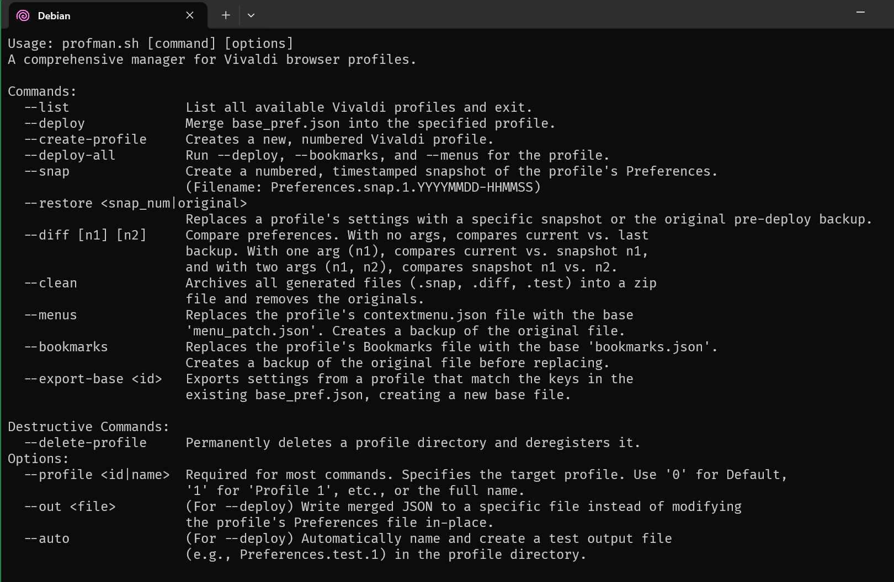

# Profile Manager for Vivaldi (`profman.sh`)

`profman.sh` is a powerful BASH command-line tool for managing Vivaldi browser profiles. It allows you to define a base set of preferences and apply them across multiple profiles, create and restore snapshots, manage bookmarks and context menus, and perform advanced operations like diffing configurations and creating/deleting profiles programmatically.

*Version 0.8 introduces a breaking change, please review the [CHANGELOG.md](CHANGELOG.md) for details*


## Features

- **Profile Management**: List, create, and permanently delete Vivaldi profiles.
- **Preference Merging**: Define a `base_pref.json` file and merge its settings into any profile, preserving other settings.
- **Snapshot System**: Create timestamped snapshots of a profile's preferences, compare them, and restore to any previous state.
- **Configuration Templating**: Replace a profile's Bookmarks or context menus with a master version from your configuration directory.
- **Settings Export**: Export the configuration from an existing profile to create a new base template.
- **Housekeeping**: Clean up all generated backup and diff files into a single zip archive.
- **Cross-Platform**: Works on Linux, macOS, and in WSL for Windows.

## Default Skeleton

The default skeleton preferences for Profman create a clean debloated UX that you can deploy to all your profiles: 


## Prerequisites

Before using `profman.sh`, you need to have the following command-line utilities installed:

- `jq`: For processing JSON data.
- `zip`: For the `--clean` command.
- `diffutils`: For the `--diff` command.

On Debian/Ubuntu, you can install them with:
```bash
sudo apt-get update
sudo apt-get install jq zip diffutils
```

## Important Notes

**Test For Portability**. Please note that this has only been tested (so far) on Debian, PopOS and WSL/Windows! If you have a BASH command prompt I strongly encourage you to run `./test.sh` to make sure all features pass on your OS before running actual commands.



**Skeleton Files**. The default preferences that come preconfigured in the `skel` directory nuke all of the themes except a base light and dark one. If you are running `profman.sh` against an already existing profile, please be sure to export your themes in case they get overwritten. Given the happy path, your Preferences file will automatically be backed up, but better safe than sorry. This also applies to Bookmarks and Context Menu settings as well. 

## Setup and Configuration

1.  **Permissions**: Make the scripts executable:
    ```bash
    chmod +x profman.sh
    chmod +x test.sh
    ```

2.  **Path Configuration**: The script needs to know where your Vivaldi "User Data" directory is.
    -   **For WSL (Windows Subsystem for Linux)**: The script will automatically detect WSL. You must set the `WIN_USER_ROOT` environment variable to point to your Windows user folder. Add this to your `.bashrc` or `.zshrc`:
        ```bash
        export WIN_USER_ROOT="/mnt/c/Users/YourWindowsUsername"
        ```
    -   **For Linux/macOS**: Open `profman.sh` in a text editor and modify the `VIVALDI_USER_DATA_PATH_MANUAL` variable to the correct path for your system.

3.  **Initial Run & Configuration Files**: The first time you run the script (e.g., with `./profman.sh --list`), it will automatically generate the following user-editable configuration files in the same directory as the script:
    -   `base_pref.json`: Your master preferences file. Edit this to define the settings you want to apply to your profiles.
    -   `bookmarks.json`: Your master bookmarks file. Used by the `--bookmarks` command.
    -   `menu_patch.json`: Your master context menu file. Used by the `--menus` command.

    **Customizing the Base Template**:
    To maintain your own starting template for preferences without modifying the `skel` directory, you can create a file named `local.base_pref.json` in the same directory as the script. If this file exists when `base_pref.json` is being created for the first time, it will be used as the source instead of the default `skel/base_pref.skel.json`.

    **Customization Hack**:
    Currently Bookmarks and Menus dont allow for a local override (yet). But if you absolutely need to configure these for your needs just make a backup of the /skel directory and update the skel files as needed. The skel files are there to be non-deletable files, so its important to keepup a backup of your last known working copies in case something goes amiss. 

> **IMPORTANT**: Always ensure Vivaldi is completely closed before running any commands that modify profile data.

## Command Reference



### Profile Selection

All commands that operate on a profile require the `--profile` argument.

`--profile <id|name>`
: Specifies the target profile.
  - Use `0` for the `Default` profile.
  - Use a number (e.g., `1`) for `Profile 1`.
  - Use the full quoted name (e.g., `"Profile 1"`).

---

### Core Commands

`--deploy`
: Merges the settings from `base_pref.json` into the specified profile's `Preferences` file.
  ```bash
  # Merge base settings into the Default profile
  ./profman.sh --profile 0 --deploy
  ```

`--list`
: Lists all available Vivaldi profiles with their corresponding IDs.
  ```bash
  ./profman.sh --list
  ```

`--snap`
: Creates a numbered, timestamped snapshot of the target profile's `Preferences` file.
  ```bash
  # Create a snapshot for Profile 1
  ./profman.sh --profile 1 --snap
  ```

`--restore <snap_num>`
: Replaces a profile's current `Preferences` with a specific snapshot. A backup of the current settings is created first.
  ```bash
  # Restore Profile 1 to its state from snapshot #2
  ./profman.sh --profile 1 --restore 2
  ```

`--diff [n1] [n2]`
: Compares preference files and shows the differences.
  - **No args**: Compares the current `Preferences` with the backup from the last merge.
  - **One arg (n1)**: Compares the current `Preferences` with snapshot `n1`.
  - **Two args (n1, n2)**: Compares snapshot `n1` with snapshot `n2`.
  ```bash
  # See what changed in Default profile since the last merge
  ./profman.sh --profile 0 --diff

  # Compare current settings of Profile 1 with its 3rd snapshot
  ./profman.sh --profile 1 --diff 3
  ```

`--clean`
: Finds all generated files (`.snap.*`, `.test.*`, `.diff`, backups) for a profile, archives them into a `.zip` file, and removes the originals.
  ```bash
  ./profman.sh --profile 1 --clean
  ```

---

### File Replacement Commands

`--menus`
: Replaces the profile's `contextmenu.json` file with your master `menu_patch.json`. A backup of the original file is created.
  ```bash
  ./profman.sh --profile 2 --menus
  ```

`--bookmarks`
: Replaces the profile's `Bookmarks` file with your master `bookmarks.json`. A backup of the original file is created.
  ```bash
  ./profman.sh --profile 2 --bookmarks
  ```

---

### Advanced & Destructive Commands

`--create-profile`
: Programmatically creates a new, numbered Vivaldi profile by updating the `Local State` file.
  ```bash
  ./profman.sh --create-profile
  ```

`--delete-profile`
: **IRREVERSIBLE**. Permanently deletes a profile directory and deregisters it from the `Local State` file. You will be asked for confirmation.
  ```bash
  ./profman.sh --profile 4 --delete-profile
  ```

`--export-base <id>`
: Creates a new `base_pref.exported.json` file. This file will contain the settings from the specified profile, but only for the keys that already exist in your `base_pref.json` template. This is useful for updating your base configuration from a profile you've configured in the UI.
  ```bash
  ./profman.sh --export-base 0
  ```

---

### Deploy Options

These options modify the behavior of the `--deploy` command.

`--out <file>`
: Writes the result of a merge to a specified file instead of modifying the profile's `Preferences` file in-place.

`--auto`
: A "dry run" mode. Automatically names and creates a test output file (e.g., `Preferences.test.1`) in the profile directory without modifying the original.
  ```bash
  # Do a dry run merge on Profile 2
  ./profman.sh --profile 2 --deploy --auto
  ```

## Example Workflow

1.  **Initialize**: Run `./profman.sh --list` to generate your config files.
2.  **Configure**: Open `base_pref.json` and customize the settings to your liking.
3.  **Apply**: Run `./profman.sh --profile 0 --deploy` to merge your settings into the Default profile.
4.  **Snapshot**: Create a baseline snapshot: `./profman.sh --profile 0 --snap`.
5.  **Use Vivaldi**: Launch Vivaldi, use the browser, and change some settings via the UI.
6.  **Review Changes**: Close Vivaldi and run `./profman.sh --profile 0 --diff` to see exactly what settings were changed by your UI interactions.
7.  **Update Base Config**: If you like the changes, use `./profman.sh --export-base 0` and review the exported file to update your `base_pref.json`.

## Testing

The project includes a test suite to verify its core functionality. It runs in a temporary, isolated environment and will not affect your real Vivaldi data.

To run the tests:
```bash
./test.sh
```

## License

MIT.
